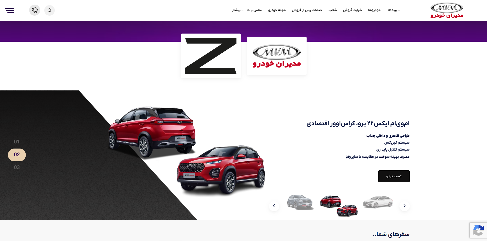
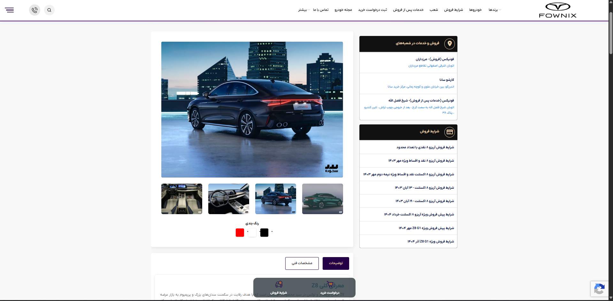
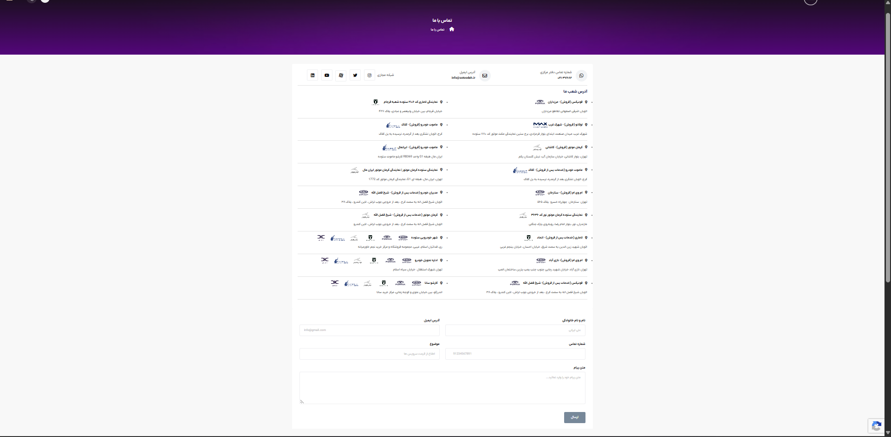

# Sotoodeh Auto Group - Enterprise Automotive Dealership Platform

**🔗 Live Website:** [https://sotoodeh.ir/](https://sotoodeh.ir/)

> **🔒 Proprietary Software Disclaimer**
> This repository is maintained strictly as an architectural and design showcase. The source code is proprietary and belongs to Sotoodeh Automotive Group. No closed-source application logic, databases, or internal infrastructure data is exposed here.

Sotoodeh Auto Group is a leading multi-brand automotive dealership network. This enterprise-level corporate platform was developed to serve as the digital headquarters for the business, showcasing top automotive brands (such as Fownix, MVM, Kerman Motor, and Lamari), managing customer inquiries, and streamlining the vehicle purchasing process.

## 📸 Platform Previews

### 🚗 Multi-Brand Vehicle Catalog & Showcases

### 📄 Purchase Requests & Lead Generation

### 🏢 Branch Locator & After-Sales Services

## 🎯 Business Value & Core Objectives
In the highly competitive automotive market, this platform acts as an automated sales funnel and customer trust-builder:
* **High-Conversion Lead Generation:** Optimized inquiry forms, test-drive bookings, and leasing/installment calculators designed to turn website visitors into qualified dealership foot traffic.
* **Unified Brand Experience:** A scalable UI architecture that elegantly accommodates distinct visual identities for multiple global automotive brands under one parent umbrella.
* **Streamlined After-Sales:** Digital booking for periodic maintenance and after-sales services, reducing phone traffic and improving customer satisfaction.
* **Performance & SEO:** Architected for rapid loading times and high search engine visibility to capture local market queries.

## 🏛 Technical Architecture & Tech Stack

The platform is designed to handle high traffic volumes and complex relational data (vehicles, branches, pricing conditions) efficiently.

### Core Technologies
* **Frontend UI/UX:** [e.g., Next.js / React / HTML5 & Bootstrap]
* **Backend Logic & CMS:** [e.g., Node.js / Custom PHP / Laravel]
* **Database:** [e.g., MySQL / PostgreSQL]
* **Styling & Animation:** [e.g., Tailwind CSS / jQuery / WOW.js]

## 🚀 Key System Features
* **Dynamic Content Management:** Allows admins to rapidly update active sales conditions, leasing terms, and vehicle pricing without touching the code.
* **Responsive Architecture:** Pixel-perfect mobile optimization, recognizing that the majority of automotive research is conducted on smartphones.
* **Security Measures:** Robust form validations and anti-spam protocols (reCAPTCHA) to ensure sales teams receive clean, verified leads.
